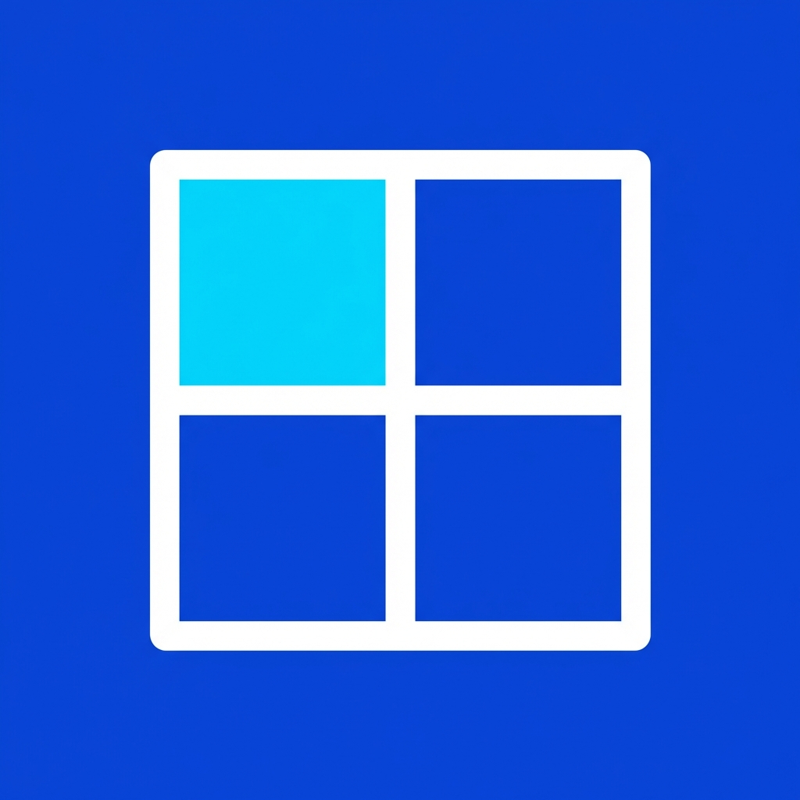

# The Griddler 🧩

The Griddler is a lightweight, powerful window management tool for Windows that allows you to snap windows to a customizable grid using your mouse. Inspired by WindowGrid, it provides a seamless way to organize your workspace with precision.



## 🚀 For Users

### How to Use
1.  **Run the App**: Launch `TheGriddler.exe`. It will sit quietly in your system tray.
2.  **Activate the Grid**:
    *   Click and hold the **Left Mouse Button** on a window's title bar (start dragging).
    *   While holding, **Right-Click** once to activate the grid overlay.
3.  **Define the Area**:
    *   The first right-click defines the starting corner of your grid selection.
    *   Move your mouse to span the desired area.
    *   **Right-Click again** or **Release Left-Click** to snap the window to the selected area.
4.  **Configure Settings**:
    *   Open the settings menu from the taskbar icon.
    *   Adjust the number of rows and columns for each monitor independently.
    *   Customize the colors of the grid lines and selection area.
    *   Toggle between **Light** and **Dark** modes.

### Features
- **Independent Monitor Grids**: Set different grid sizes for each of your displays.
- **High DPI Support**: Works perfectly on multi-monitor setups with different scaling factors.
- **Customizable Aesthetics**: Change colors and themes to match your desktop.
- **Minimal Footprint**: Low memory and CPU usage.

---

## 💻 For Developers

### Prerequisites
- **Visual Studio 2022** or **VS Code**.
- **.NET 10.0 SDK**.
- Windows OS (Required for Win32 API and WPF).

### Building the Project
1.  Clone the repository.
2.  Open a terminal in the project root.
3.  Run the following commands:
    ```bash
    dotnet build
    dotnet run
    ```

### Project Structure
- `MainController.cs`: The core engine that handles global input hooks and coordinates window snapping logic.
- `WindowManager.cs`: A wrapper around Win32 APIs for window manipulation, DPI awareness, and monitor info.
- `GridOverlay.xaml`: The WPF window that renders the grid lines and selection rectangle.
- `Settings.cs`: Manages persistent user preferences (JSON-based).
- `GlobalHook.cs`: Handles low-level mouse hooks to detect dragging and clicking outside the app.

### Key Technologies
- **WPF**: Used for the UI and overlay.
- **Win32 API**: Used for low-level window management (`SetWindowPos`, `GetWindowRect`, etc.).
- **Global Mouse Hook**: Used to intercept mouse events while other windows are focused.

---

## 🛠 Maintainability & Design
The codebase is designed with a separation of concerns:
- **UI Logic** is kept in XAML and its code-behind.
- **Native Interop** is centralized in `WindowManager.cs`.
- **Application State** is managed via the `Settings` singleton with `INotifyPropertyChanged` for reactive UI updates.

---

## 📜 Credits
- Created by **derac**.
- Inspired by **WindowGrid** by Joshua Wilding.

---

*Happy Gridding!*
